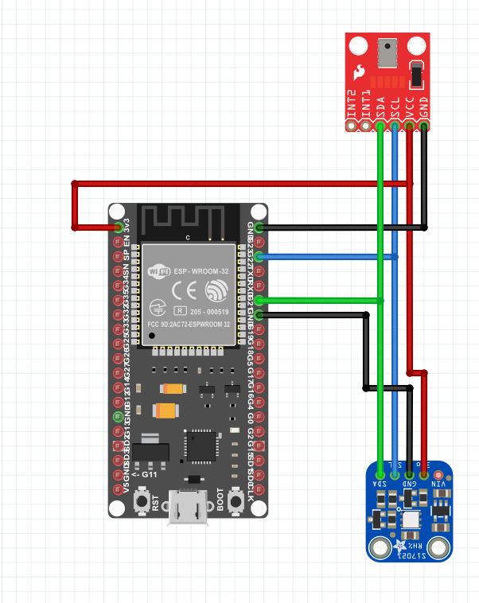

# ESP32 Sampler

The TL;DR is that I got excited about looking into how to use [Split Phase Current Measurement](https://circuitsetup.us/index.php/product/split-single-phase-real-time-whole-house-energy-meter-kit-programmed-esp32-2-cts-abs-box/) kit, and trying to figure out how to avoid installing some arbitrary annoying PHP software that is called ESPMon.

I soon started reading the docs on [FreeRTOS](www.freertos.com), and quickly bought:

* I2C Hygrometer [SI7021](https://www.adafruit.com/product/3251)
* I2C Barometer [MPL3115A2](https://www.adafruit.com/product/1893)
* SPI based on a ATM90E32 [Split Phase Current Measurement](https://circuitsetup.us/index.php/product/split-single-phase-real-time-whole-house-energy-meter-kit-programmed-esp32-2-cts-abs-box/)

With the intent to spew data into a MQTT queue installed inside my home network.

# Wiring Diagram

# MQTT Enpoints

Running `make menuconfig` will allow one to modify the bulk of what is in there, but the defaults do the following.  Data points all have the same structure:

> {"t":1231231,"v":832.234662}

`t` is the ESP32's `millis()` clock that eventually rolls over.  V is the 

|Topic|Data|
|:----|:---|
|heartbeat/pwr| Heartbeat message with a brief timestamp.  Messages here are strings, and are triggered when  the SPI poll has errant data|
|heartbeat/wxpwr| Heartbeat for main monitor loop. Contains slightly different data values |
|sensor/wx/p| Pressure, in mBar|
|sensor/wx/pth| Temperature of the barometer sensor.  Could be used for 
calibration|
|sensor/wx/rh| Relative humidity in %RH.  Is not clipped to 100 and may be wildly off during temperature shocks|
|sensor/wx/rht| Relative humidity sensor temperature in C. Could be used for calibration|
|sensor/power/f| Frequency, in Hz|
|sensor/power/v1| Phase 'A' voltage, RMS|
|sensor/power/v2| Phase 'C' voltage, RMS (not entirely sure how this is different from v1 above|
|sensor/power/i1| Phase 'A' current (amps) |
|sensor/power/i2| Phase 'C' current (amps) |
|sensor/power/I| Total current (A+C) |
|sensor/power/ap| [Apparent Power](https://en.wikipedia.org/wiki/AC_power#Active,_reactive,_and_apparent_power) |
|sensor/power/ap| [Power Factor](https://en.wikipedia.org/wiki/Power_factor) |
|sensor/power/t| Temperature sensor |
|sensor/power/f|  AC Frequency |
|sensor/power/w| Power (Watts) |

# Why?

Do you really need to to ask that?

Outside the normal `I had an itch` answers, consider the fact you are here  continuing to read this sentence; impling that you too, want to invest time tinkering in homebrewing your own tools.