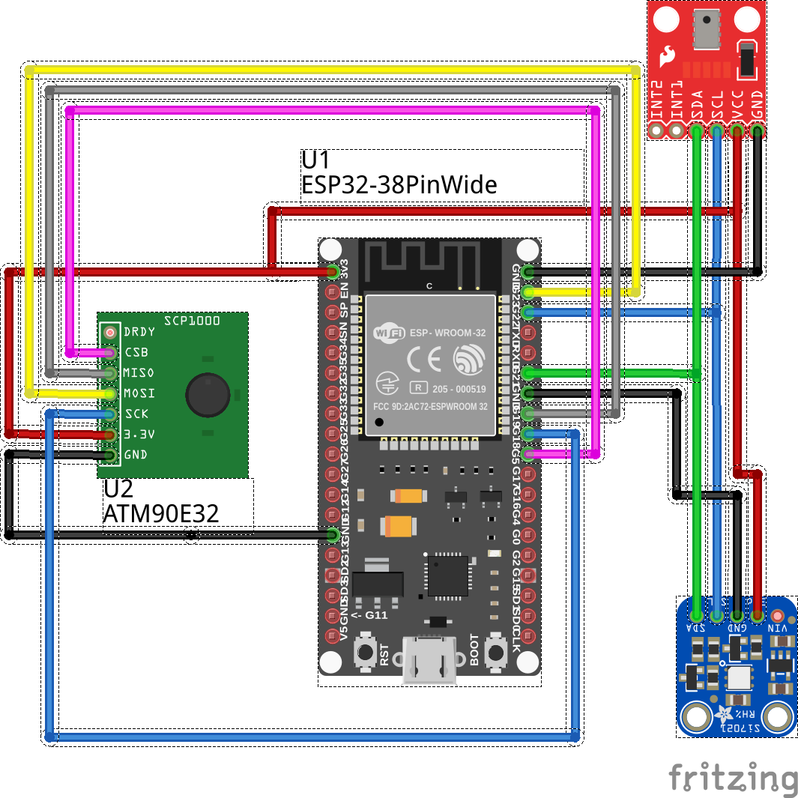

# ESP32 Sampler

The TL;DR is that I got excited about looking into how to use Split Phase Current Measurement](https://circuitsetup.us/index.php/product/split-single-phase-real-time-whole-house-energy-meter-kit-programmed-esp32-2-cts-abs-box/) kit, and trying to figure out how to avoid installing some arbitrary annoying PHP software that is called ESPMon.

I soon started reading the docs on [FreeRTOS](www.freertos.com), and quickly bought:

* I2C Hygrometer [SI7021](https://www.adafruit.com/product/3251)
* I2C Barometer [MPL3115A2](https://www.adafruit.com/product/1893)

With the intent to spew data into a MQTT queue installed inside my home network.

# Wiring Diagram

# Why?

Do you really need to to ask that?

Outside the normal `I had an itch` answers, consider the fact you are here staring, continuing to read this sentence, which obviously implies that you too, like me, want to invest time tinkering in homebrewing your own tools.